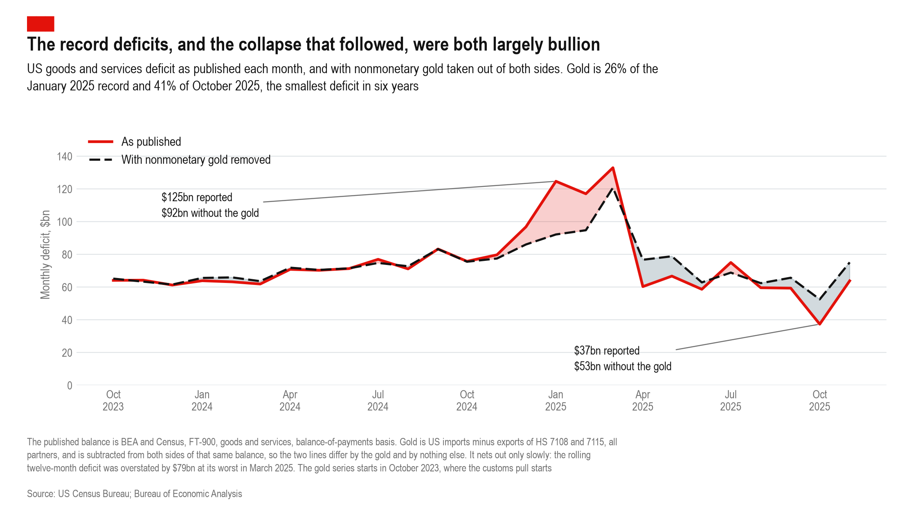

# The trade deficit, reported and with the gold taken out

```
python claude/deficit-gold-adjusted/build_deficit_gold.py
```

The FT-900 goods-and-services balance is the number that makes the headline,
moves markets and feeds the nowcasts. Unlike GDP, **it carries nonmonetary gold
in full.** BEA removes gold from the national accounts because a bar bought as a
store of value is not consumption or investment; nobody removes it from the
trade release. So the trade deficit is where the phantom flow actually lands,
and the same metal is excluded from one official statistic and headlined in
another.

The adjustment is one line. Reported balance is `X - M`; take the gold out of
both sides and it becomes `balance + net gold imports`. The published balance is
BEA's own and the gold is subtracted *from it*, rather than a deficit being
rebuilt from scratch, so the two series differ by the gold and by nothing else.



## The months everyone reacted to

| month | reported | gold | adjusted | gold % |
|---|---:|---:|---:|---:|
| 2024-12 | 96.8 | 10.8 | 86.1 | 11% |
| **2025-01** | **124.7** | **32.5** | **92.2** | **26%** |
| 2025-02 | 117.1 | 22.3 | 94.8 | 19% |
| **2025-03** | **133.0** | **12.2** | **120.8** | **9%** |
| **2025-10** | **37.4** | **-15.2** | **52.6** | **-41%** |

**The three largest monthly deficits since the series begins in 1992 are March,
January and February 2025** - consecutive, all inside the episode. Adjusted,
only *one* of the three still clears the pre-episode record of \$95.5bn set in
March 2022. Two of the three record months were records because of metal that
was in a vault in London in the morning and a vault in New York by the evening.

**Then the symmetry.** October 2025 printed a \$37.4bn deficit, the smallest
since November 2019, widely read as a structural improvement. With the gold put
back it is \$52.6bn: **41% of the "improvement" was bullion leaving the
country.** The same mechanism that produced three record deficits produced, seven
months later, the best trade month in six years. Neither was trade.

## It does not net out quickly

*Not plotted - this is a separate claim on a different axis, so it stays in the
narration rather than crowding the figure.*

The reassuring version of this - *it nets out over a year, only the monthly
print was distorted* - is the first thing anyone reaches for, and it is wrong.

| rolling 12-month deficit, overstatement from gold | |
|---|---:|
| peak, March 2025 | **\$79bn**, 7.4% of the trailing-year deficit |
| latest, November 2025 | \$16bn, 1.6% |

At the March 2025 peak every tonne had gone in and none had come back, so a full
year of data carried the whole surge and none of the reversal. Eleven months
after the metal started moving the twelve-month deficit was **still** overstated
by \$16bn, and the series ends there rather than at zero.

## And it made trade look far more volatile than it was

| monthly deficit, 26 months | reported | adjusted |
|---|---:|---:|
| standard deviation | \$21.6bn | \$13.6bn |
| range, high to low | \$96bn | \$68bn |

Taking the gold out cuts the month-to-month standard deviation by **37%**. This
distortion survives any netting: even once the round trip completes, the
impression left by a year of wild monthly prints does not reverse.

## What this is and is not

**Not a claim that BEA published a wrong number.** The gold crossed the border,
and the balance of payments is supposed to record goods crossing borders. The
point is narrower and harder to dismiss: a reader of the monthly release in
early 2025 saw a deficit exploding to successive records, and in late 2025 saw
it collapsing to a six-year low. Neither movement was a change in what America
buys or sells. It was one pile of metal moving to a different vault and then
moving back, and nothing in the headline figure let the reader see that.

**Caveats.**

- **The gold series starts October 2023**, which is where the repo's Census pull
  starts, so the adjusted line covers 26 months. Extending it needs a
  `CENSUS_API_KEY` - the API stopped serving keyless requests. The four-partner
  series that does run 2015-2026 was tested as a substitute and rejected: it
  covers between 8% and 64% of US gold imports month to month, averaging 50%.
- **The record-ranking comparison uses unadjusted figures before October 2023.**
  Monthly net gold ran between -\$3bn and +\$2bn in the year before the episode,
  so it is indicative rather than exact. The direction is not in doubt.
- **Gold is HS 7108 + 7115**, both headings, because the bars went in under 7115.
  BEA reclassifies 7115900530 as nonmonetary gold on a BOP basis, so the pair is
  the right match to the concept the published balance is built on.

## Files

| File | What it is |
|---|---|
| `build_deficit_gold.py` | the adjustment and the figure, narrating its own argument |
| `deficit_gold.pdf` / `.png` | the figure |
| `deficit_gold_monthly.csv` | reported, gold, adjusted and gold share by month |
| `build_deficit_gold_output.txt` | the narration, saved |
