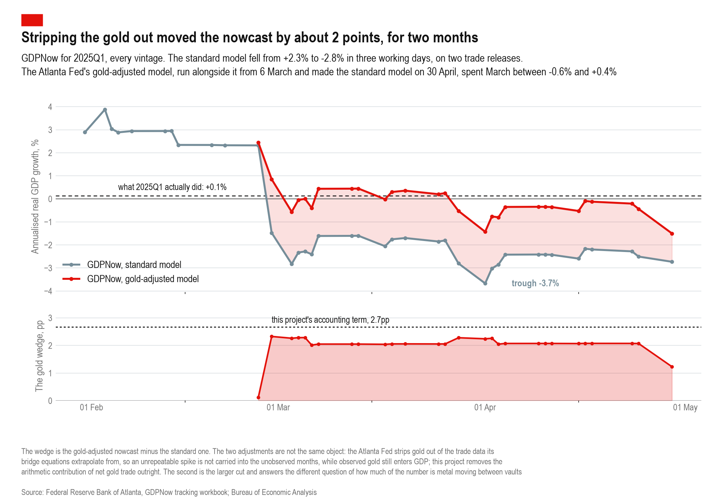

# What the excess gold trade cost, and what it did to GDP

Two questions on the same episode, from the same excess-trade estimate in
`claude/counterfactual`.

```
python claude/excess-trade-cost/build_excess_cost.py     # the cost
python claude/excess-trade-cost/build_gdp_effect.py      # the GDP effect
python claude/excess-trade-cost/make_gdpnow_chart.py     # the nowcast chart
```

## Headline

| | |
|---|---:|
| resources consumed moving the excess metal out and back | **\$166m** (\$58m - \$355m) |
| value transferred switching positions between London and New York | **\$165m** net, \$216m gross of sign |
| effect on 2025Q1 annualised real GDP growth | **-2.7pp** |
| effect on 2025Q2 annualised real GDP growth | **+5.1pp** |
| the Atlanta Fed's own gold adjustment to GDPNow for 2025Q1 | **1.2 - 2.3pp** |

The gold was cheap to move and expensive to measure. The resource bill is
0.14% of the \$118bn of metal shuttled. The measurement effect is points of
GDP.

---

# 1. The cost

## The metal

The counterfactual line - fitted to every month from January 2015 to October
2024 and carried forward - is applied to both directions. Shipping cannot be
negative, so a month below the line is charged nothing rather than credited
back.

| | westbound | eastbound | both legs |
|---|---:|---:|---:|
| the five-month episode, t | 645 | 39 | 684 |
| whole window to June 2026, t | 695 | 434 | **1,129** |

The eastbound excess is not different metal. It is the same metal going home
once the exemption of 11 April 2025 removed the tariff risk, and it is charged
again because a return flight costs what an outbound one costs. A tonne
relocated and then relocated back is two legs of freight and **two** recastings
- 400 oz London Good Delivery bars into kilobars on the way out, kilobars back
into 400 oz bars on the way home. That doubling is the "transformation" category
in `CLAUDE.md` showing up as a cost rather than as a trade statistic.

## What a leg costs

None of these is a quoted price. No public series for bullion logistics or
refining fees exists, and the flow-based threshold in `claude/carry-threshold`
could not identify one either: it put the westward cost at \$0.78 an ounce with
a 90% interval of [-0.46, +2.43], which contains zero. So this is an assumed
range with the sensitivity carried to the headline.

The split between flat and ad valorem lines is not cosmetic. Freight is charged
by weight, recasting by the bar and handling by the ounce, so those do not move
when the gold price does. Insurance and transit financing are charged on value,
so they nearly doubled inside this window because gold did.

| \$ per troy ounce, one leg | low | central | high |
|---|---:|---:|---:|
| recasting 400 oz to kilobars and 100 oz | 0.50 | 1.25 | 2.00 |
| secure air freight, transatlantic | 0.30 | 0.65 | 1.00 |
| handling, assay, vault in and out | 0.20 | 0.35 | 0.80 |
| insurance in transit (0.5 / 1.0 / 2.0 bp of value) | 0.19 | 0.37 | 0.75 |
| forgone lease income in transit (10 / 15 / 20 days) | 0.51 | 2.30 | 6.14 |
| **all in, mean over the window** | **1.70** | **4.93** | **10.69** |

The only public number in the stack is CME's \$0.35 an ounce depository
handling charge, which sits inside the handling row and is the single available
check on any of this.

## The bill

| \$ millions | low | central | high |
|---|---:|---:|---:|
| westbound, the five-month episode | 31.6 | 88.3 | 186.0 |
| westbound, whole window | 34.2 | 95.8 | 202.1 |
| eastbound, the metal coming back | 24.0 | 70.1 | 152.5 |
| **both legs** | **58.3** | **165.9** | **354.7** |

\$147,000 a tonne-leg at the central assumption, on 1,129 tonne-legs worth
\$118bn as they crossed - **0.14% of the value moved**, range 0.05% to 0.30%.

That number is the finding, not a rounding error. Moving gold is almost free
relative to what it is worth, which is precisely why a tariff threat of ten or
thirty percent could move hundreds of tonnes: the arbitrage only had to clear a
few dollars an ounce.

## The cost of switching positions

Relocating metal is also a trade - a London unallocated claim sold, a COMEX
warrant bought - and the price of that switch is the location premium estimated
in `claude/spread-series`.

**This is a transfer, not a resource cost, and it is never added to the table
above.** For the arbitrageur the premium is revenue: it is what paid for the
freight. It is a cost to whoever was on the other side, typically a dealer short
COMEX and long London closing at a dislocated level.

| | \$ millions |
|---|---:|
| the five-month episode | 172 |
| whole window, net of sign | 165 |
| whole window, gross of sign | 216 |

The signs carry information. Westbound in the surge the premium was positive, so
New York paid up for metal; on the return legs from April 2025 it is often
negative, which is London paying up to get the metal home. A negative entry is
not a refund, it is a transfer running the other way.

**Not included, and named rather than invented:** the mark-to-market on hedged
short books never closed, and the premium paid on metal that could not move at
all - which in August 2025, with the duty attached to the delivery bar and the
escape route shut, is where the entire shock went. Both need CFTC position data,
which is not in this repo.

---

# 2. The GDP effect

## The sign is the opposite of the intuition

Gold arriving in the United States is an **import**, and imports enter GDP with
a minus. A phantom import surge makes measured GDP too **low** in the quarter the
metal arrives. The over-reporting comes a quarter later, when the same metal
leaves again and is recorded as an export.

Both are in this sample, in that order.

## The arithmetic

A component's contribution to annualised real GDP growth is its change in
quantity, valued at the previous quarter's price, over the previous quarter's
nominal GDP:

```
contribution (pp) = -1600 * (dQ_t * P_t-1) / GDP_t-1
```

The minus is because this is an import. The 1600 is 400 for annualising a
quarterly rate in percent, times 4 because the trade figures are quarterly
totals and GDP is an annual rate.

Run on **total** imports, the same formula reproduces BEA's own published
contribution to a mean absolute gap of **0.24pp** across eight quarters - the
residual being chain weighting, which BEA does and this does not. That is the
calibration check that makes the gold figure believable.

## The answer

| | published | gold | without gold | published imports | published inventories | GDPNow |
|---|---:|---:|---:|---:|---:|---:|
| | % ann | pp | % ann | pp | pp | % ann |
| 2024Q4 | 2.40 | -0.63 | 3.04 | -0.13 | -0.91 | 2.3 |
| **2025Q1** | **0.14** | **-2.67** | **2.81** | -4.31 | +2.54 | **-2.7** |
| **2025Q2** | **4.02** | **+5.14** | **-1.12** | +4.71 | -3.17 | 2.9 |
| 2025Q3 | 3.88 | -1.60 | 5.48 | +0.01 | -0.14 | 3.5 |

- **2025Q1** measured GDP was too **low** by 2.7pp. Gold alone is **62%** of the
  entire import drag on that quarter.
- **2025Q2** measured GDP was too **high** by 5.1pp - this is the over-reporting.
  Gold is **109%** of the entire import boost: it more than accounts for the
  whole thing. Published growth of 4.02% becomes **-1.12%** with the gold term
  removed.
- The swing between the two quarters is **7.8pp**, and over 2024Q4-2025Q3 the
  gold terms sum to **+0.23pp**. A round trip nets out in the level. It does not
  net out in any single quarter's growth rate, and quarterly growth rates are
  what policy reacts to.

## Whether it survives into published GDP

Only if the offsetting entry is wrong. Imported gold that sits in a vault is
inventory investment, which enters with a plus of the same size; set against
each other the effect on GDP is exactly zero and only the **composition** is
distorted.

| | imports | inventories | net |
|---|---:|---:|---:|
| 2025Q1 | -4.31pp | +2.54pp | -1.77pp |
| 2025Q2 | +4.71pp | -3.17pp | +1.54pp |

BEA did book a large offsetting inventory swing in both quarters, of the same
order as the gold term and with the right sign. That is **consistent with** the
offset working; it is not proof, because the same two quarters saw broad tariff
front-running in everything else and the inventory line is not gold's alone.

So the statement is conditional and both branches matter:

- if the inventory entry matched the gold, published GDP is right and only its
  composition is wrong - the import drag and the inventory boost on 2025Q1 are
  each about 2.7pp too big;
- if it did not, 2025Q1 growth is understated by up to 2.7pp and 2025Q2
  overstated by up to 5.1pp.

## The nowcast had no offset at all

A nowcast bridges from monthly source data. The advance trade report arrives
weeks before any inventory figure, so an import surge hits the nowcast
immediately and the cancelling entry arrives late or not at all. That is
structural, not an error by anyone.

`make_gdpnow_chart.py` plots this directly, from the Atlanta Fed's own
published tracking workbook rather than from a reconstruction of it.



| | |
|---|---:|
| GDPNow, standard model, 26 February | +2.32% |
| GDPNow, standard model, 3 March | **-2.82%** |
| GDPNow, gold-adjusted model, 3 March | **-0.56%** |
| standard model trough, 1 April | -3.67% |
| final vintage, 29 April: standard / gold-adjusted | -2.73% / -1.50% |
| BEA advance estimate | -0.28% |
| actual, after revisions | +0.14% |

The standard model fell 5.1 points in three working days on two trade releases.
The gold-adjusted model fell 3.0 points over the same span and then spent March
between -0.6% and +0.4%. **The wedge between them is 2.3pp at its widest and
2.1pp for most of two months**, narrowing to 1.2pp at the final vintage as the
model accumulated observed data and had less left to extrapolate.

The Atlanta Fed made the gold-adjusted model the **standard** GDPNow on 30 April
2025 and discontinued the old one for 2025Q1. This is not a side experiment.

### Correcting something stated earlier in this folder

An earlier version of this README pointed out that GDPNow's final 2025Q1 miss
(-2.87pp) and the accounting gold term computed here (-2.67pp) agree to 0.20pp,
and called that corroboration. **That reading was too strong.** The Atlanta
Fed's own gold adjustment moves their nowcast by 1.2-2.3pp, not 2.9pp, so gold
does not account for the whole miss and the near-equality was a coincidence.

The two numbers are also not the same object, which is why they need not match:

| | what it does | 2025Q1 |
|---|---|---:|
| **Atlanta Fed** | subtracts gold from the BOP goods aggregates the bridge equations are fitted and forecast on, so an unrepeatable spike is not extrapolated into the months of the quarter not yet observed. Observed gold still enters GDP. A fix to the **forecast**. | 1.2-2.3pp |
| **This project** | removes the arithmetic contribution of net gold trade from measured growth outright, assuming nothing offsets it. A statement about the **accounting**. | 2.67pp |

The second is the larger cut by construction. It exceeds their wedge rather than
contradicting it.

This is a **replication, not a discovery**. The Atlanta Fed diagnosed it at the
time, recalibrated GDPNow between 28 February and 6 March 2025, and ran two
versions of the nowcast for two months. What is new here is that one
excess-trade estimate now carries both a cost figure and a GDP figure.

---

## A correction to the build order

`CLAUDE.md` step 5 says to pull **US Census monthly HS 7108**. On its own that
heading misses almost the entire episode.

| \$bn, US imports | HS 7108 | HS 7115 |
|---|---:|---:|
| 2024-11 | 2.16 | 2.18 |
| 2024-12 | 3.19 | **10.30** |
| 2025-01 | 3.79 | **30.44** |
| 2025-02 | 2.45 | **24.73** |
| 2025-03 | 0.68 | **17.12** |

The bars went in under **7115**, "other articles of precious metal". Both
headings are needed, and the bilateral panel already uses both - it is the
written instruction that is wrong.

This is confirmed in the Atlanta Fed's own model documentation, which names the
ten-digit line and the reason:

> harmonized system code 7115900530: "Articles of precious metal, in rectangular
> shapes, 99.5% or more by weight of precious metal, not otherwise marked or
> decorated, of gold" is classified under "finished metal shapes and advanced
> manufacturer" items on a Census basis but **reclassified as nonmonetary gold
> on a BOP basis**.

So Census and BEA disagree about what this metal is, and a Census-based pull has
to add 7115 back by hand to see what BEA sees. Quantity check: the Atlanta Fed
put nonmonetary gold imports at \$13.2bn in December 2024 and \$32.6bn in
January 2025 on a BOP basis; the two headings together give \$13.5bn and
\$34.2bn. The small gap is the rest of the Census-to-BOP adjustment.

## What this is not

- **The cost figures are assumptions with a range, not quotes.** The widest
  ranges are on the unit costs, not on the measured quantities. A single freight
  quote would do more for this number than any amount of further estimation.
- **The GDP figures are accounting, not causal.** They say what the trade data
  did to the published aggregates. They do not say what would have happened to
  output had the episode never occurred.
- **The two universes are not the same.** The cost work uses Swiss and UK
  customs figures, because they carry mass; the GDP work uses US Census, because
  that is what feeds BEA. The 645 t episode excess and the 740 t of net US
  imports in 2025Q1 are different windows and different reporters, and they are
  not meant to reconcile to the tonne.
- **The trade pull ends November 2025**, so quarters after 2025Q3 are dropped
  rather than annualised from part of a quarter.
- **The nowcast chart depends on a file the Atlanta Fed moves.** The workbook
  lived under `/cqer/researchcq/gdpnow/` and now lives under
  `/research-and-data/data/gdpnow/`; the script fails loudly with the page to
  check rather than silently plotting an error page. The sheet's own title row
  reads "2025q2" while the sheet name, the vintage dates and the advance-estimate
  date all say 2025q1 - the title is stale, and the data is Q1.

## Files

| File | What it is |
|---|---|
| `build_excess_cost.py` | the cost ledger, narrating its own argument |
| `build_gdp_effect.py` | the GDP arithmetic and its figure |
| `make_gdpnow_chart.py` | GDPNow standard against gold-adjusted, from the Atlanta Fed workbook |
| `cost_ledger.csv` | resources and transfers, low / central / high |
| `excess_cost_monthly.csv` | tonne-legs, unit costs and premium by month |
| `gdp_effect_quarterly.csv` | net gold trade and contributions by quarter |
| `gold_and_gdp.pdf` / `.png` | net gold trade and the GDP contribution |
| `gdpnow_gold.pdf` / `.png` | the two nowcast paths and the wedge between them |
| `gdpnow_gold_daily.csv` | both nowcast paths by vintage date |
| `build_*_output.txt` | the narrations, saved |
